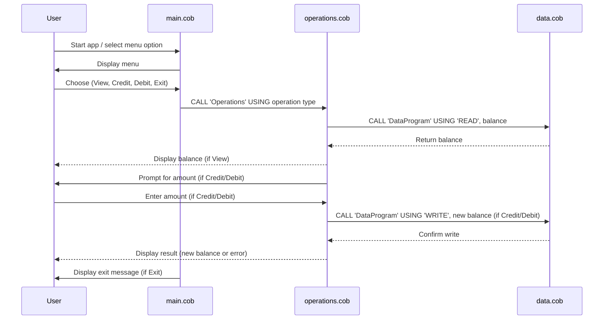

# COBOL Application Documentation

## Overview
This COBOL application is a simple Account Management System designed to manage student accounts. It allows users to view their balance, credit their account, and debit their account, enforcing basic business rules such as preventing overdrafts.

## COBOL Source Files

### 1. `main.cob`
**Purpose:**
- Serves as the entry point for the application.
- Presents a menu-driven interface to the user.
- Handles user input for the following actions:
  - View Balance
  - Credit Account
  - Debit Account
  - Exit
- Delegates account operations to the `Operations` program via COBOL `CALL` statements.

**Key Functions:**
- Loops until the user chooses to exit.
- Validates user input and displays appropriate messages for invalid choices.

**Business Rules:**
- Only allows menu choices 1-4.

---

### 2. `operations.cob`
**Purpose:**
- Implements the core business logic for account operations.
- Handles three main operations: viewing balance, crediting, and debiting the account.
- Interacts with the `DataProgram` to read and write the account balance.

**Key Functions:**
- `TOTAL`: Reads and displays the current balance.
- `CREDIT`: Prompts for an amount, adds it to the balance, and updates the stored value.
- `DEBIT`: Prompts for an amount, checks for sufficient funds, subtracts from the balance if possible, and updates the stored value.

**Business Rules:**
- Prevents debiting more than the available balance (no overdrafts allowed).
- All amounts are handled as numeric values with two decimal places.

---

### 3. `data.cob`
**Purpose:**
- Acts as a simple data storage and retrieval module for the account balance.
- Provides read and write access to the balance for other programs.

**Key Functions:**
- `READ`: Returns the current stored balance.
- `WRITE`: Updates the stored balance with a new value.

**Business Rules:**
- The balance is initialized to 1000.00 at program start.
- Only the `Operations` program should interact with this module for balance changes.

---

## Business Rules Summary
- The account balance cannot go below zero.
- All operations are menu-driven and require user confirmation.
- The initial balance is set to 1000.00.

## Running the Application
After compiling, run the application from the project root:

```bash
./accountsystem
```

Follow the on-screen prompts to manage the student account.

---

## Sequence Diagram: Data Flow


